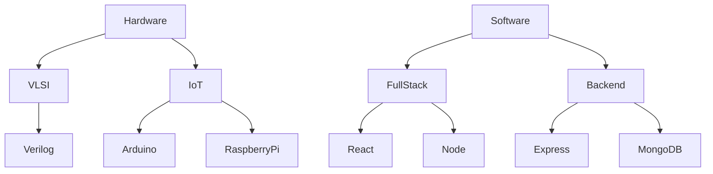

# 🚀 Tanmay | Engineering Explorer of Hardware x Software Realms  

```yaml
status: "Building the Future"
location: "VIT Chennai 🌍"
role: "ECE Undergrad | Embedded + VLSI + Full-stack Dev"
```

---

## 👾 About Me  
I’m an **Electronics & Communication Engineer-in-progress** with a passion for blending the **physical world of circuits** and the **digital world of software**.  

- ⚡ Designing with **Verilog & VLSI Systems**  
- 🌐 Developing **Full-stack apps & backend systems**  
- 📡 Experimenting with **IoT, Embedded Systems & Signal Processing**  
- 🎯 Mission: *To bridge the gap between silicon and software*  

🧠 Fun fact: My code runs faster when powered by **coffee + synthwave beats**  

---

## 🛠️ Tech Playground  



---

### ⚙️ Languages & Tools  
<p align="center">
  
</p>


## 📂 Featured Projects  

- 🛰 **[Digital Systems in Verilog](https://github.com/Vitiantanmay/)** – Circuits from adders to processors, HDL-driven  
- 🌐 **[Backend Services](https://github.com/Vitiantanmay/backend)** – REST APIs with authentication & DB magic  
- 🔗 **IoT Sensor System** – Real-time monitoring, sensors + cloud integration  

---

## 🌌 Connect & Collaborate  

<p align="center">
  <a href="https://www.linkedin.com/in/Vitiantanmay/"></a>
  <a href="mailto:your.tanmaygalav@gmail.com"></a>
  <a href="https://github.com/Vitiantanmay"></a>
</p>

---

<div align="center">

✨ *“The boundary between hardware and software is just imagination.”* ✨  


